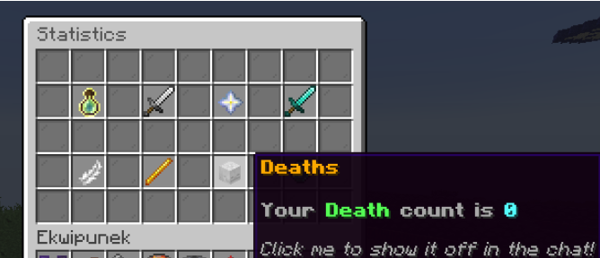

Hi! If you want to use the plugin, you have to drag and drop the downloaded JAR file into your server's plugin folder.
You can then just launch the server and use /vp to launch the main command.
MC version: 1.20-1.21.1; dependencies: PlaceholderAPI

This is a stat system plugin. You kill stuff, you gain points, you level up and gain perks.
For server owners: You can create cool leaderboards since this plugin has PlaceholderAPI support.

Resource link: https://hangar.papermc.io/szym402pl/victory-point-system/
preview:  , 
